# Personal Expense Tracker

A personal expense tracking system built using Telegram, n8n, Supabase, and OpenAI.

The system allows expenses to be logged conversationally through Telegram, categorizes transactions using a hybrid rule-based + AI-assisted pipeline, stores structured financial data in Supabase, and generates automated weekly spending reports.

The core philosophy behind the project is simple:

> Expense tracking should feel frictionless, useful, and non-judgemental.

---

# Why I Built This

Most expense trackers fail because they create too much friction.

Opening an app, filling forms, selecting categories manually, and constantly seeing financial “warnings” makes tracking feel emotionally exhausting over time.

I wanted a system that:
- was easy to use,
- accepted natural language,
- reduced manual effort,
- and quietly helped me understand my financial habits.

Instead of forcing structured inputs, the system allows conversational logging through Telegram.

Example:

```text
1200 Swiggy - dinner with friends
350 Uber 
100000 Bluestone - necklace
```

The system parses the entries, classifies them intelligently, stores them in a database, and generates automated reports every week.

---

# Key Features

- Conversational expense logging through Telegram
- Multi-line transaction parsing
- Hybrid deterministic + AI-assisted categorization
- Need vs Want classification
- AI reasoning using merchant names and notes
- Automated weekly reports
- Category-wise spending summaries
- Top spending analysis
- IST-aware timestamp handling
- Structured Supabase database

---

# Tech Stack

| Layer | Technology |
|---|---|
| Automation | n8n |
| Database | Supabase |
| AI Model | GPT-4.1-mini |
| Messaging Interface | Telegram Bot API |
| Logic / Parsing | JavaScript |

---

# System Architecture

```text
Telegram
   ↓
Parser (JavaScript)
   ↓
Deterministic Merchant Logic
   ↓
AI Categorization Layer
   ↓
Supabase Database
   ↓
Weekly Report Workflow
   ↓
Telegram Summary Delivery
```

---

# Expense Logging Flow

Expenses are logged directly through Telegram using natural language.

Example input:

```text
1200 Swiggy - dinner with friends
450 Uber - airport drop
3500 Label Rasleela - top
```

The parser extracts:
- amount
- merchant
- optional notes
- timestamp

The categorization layer then classifies:
- category
- Need vs Want
- confidence score
- reasoning behind classification

---

# Categories

The current categorization system supports:

- Food
- Transport
- Groceries
- Bills
- Shopping
- Health
- Entertainment
- Misc

---

# Why Both Rule-Based and AI Categorization Exist

The project originally began with a deterministic rule-based categorization system.

Simple merchants and recurring transactions were easy to classify reliably using predefined mappings and rules.

Examples:
- Swiggy → Food
- Uber → Transport
- Netflix → Entertainment

However, rule-based systems struggled with:
- ambiguous merchant names,
- new merchants,
- contextual interpretation,
- and transactions where the note changed the meaning.

Example:

```text
3500 Label Rasleela - top
```

The merchant name alone is ambiguous.

But the note:
```text
top
```

provides enough contextual information for AI to infer that the transaction is related to clothing and should be categorized under Shopping.

To handle these cases, the project evolved into a hybrid architecture combining:

## Deterministic Categorization

Used for:
- recurring merchants
- known mappings
- fast and reliable classification

## AI-Assisted Categorization

Used for:
- unknown merchants
- ambiguous transactions
- contextual reasoning using notes
- Need vs Want classification

This hybrid approach improves:
- consistency
- accuracy
- explainability
- latency
- and long-term maintainability

The system is currently evolving toward a merchant memory layer, where known merchant mappings are stored and reused before invoking AI classification.

---

# AI Categorization

The system uses GPT-4.1-mini for:
- categorization
- merchant understanding
- reasoning from notes
- Need vs Want classification

Example:

### Input

```text
3500 Label Rasleela - Top
```

### AI Output

```json
{
  "category": "Shopping",
  "need_or_want": "Want",
  "confidence": "high",
  "classification_reason": "The transaction appears to be related to clothing/fashion purchases."
}
```

The AI outputs structured JSON so values can be directly mapped inside n8n workflows.

---

# Weekly Reports

A weekly report is automatically generated and delivered through Telegram every Monday at 9 AM IST.

The reporting window is:

```text
Monday 12:00 AM IST → Sunday 11:59 PM IST
```

The report includes:
- total spend
- Need vs Want breakdown
- category-wise breakdown
- top 3 largest spends

Example:

```text
Total Spend: ₹2000

Needs: ₹1500
Wants: ₹500

Category Breakdown:
- Shopping: ₹300
- Groceries: ₹600
- Transport: ₹100
- Bills: ₹300
- Food: ₹300
- Misc: ₹100
```

---

# Database Design

The transaction table currently stores:

| Field | Description |
|---|---|
| id | Unique transaction ID |
| date | IST-aware transaction timestamp |
| amount | Transaction amount |
| merchant | Merchant name |
| category | Expense category |
| needwant | Need vs Want classification |
| notes | Optional transaction notes |
| confidence | AI confidence score |
| reason | Reasoning behind categorization |

---

# Important Engineering Decisions

## 1. Hybrid Deterministic + AI Architecture

The system is now evolving toward:
- deterministic merchant memory
- AI fallback classification

This improves:
- consistency
- accuracy
- explainability
- latency
- token efficiency

---

## 2. Timezone Handling

Early versions:
- lost Sunday transactions,
- produced inconsistent weekly reports,
- and mixed UTC with IST incorrectly.

The final implementation:
- stores full timestamps,
- uses IST-aware reporting windows,
- and avoids rolling “last 7 days” ambiguity.

---

## 3. Structured AI Outputs

The AI layer originally returned conversational text outputs.

This made downstream automation fragile.

The workflow was redesigned to enforce:
- strict JSON outputs
- structured schemas
- deterministic parsing

This made n8n variable mapping significantly more reliable.

---

# Parser Features

The parser currently supports:
- multi-line entries
- optional notes
- comma-separated numbers
- decimal amounts
- merchant normalization

Examples:

```text
1,200 Swiggy
10,111 Ikea
1,00,000 Bluestone
499.50 Uber
```

---

# Philosophy

The most interesting part of this project is not the AI.

It is the attempt to build a financial system that feels:
- lightweight,
- emotionally safe,
- and sustainable to use long-term.

The goal was not to optimize budgeting aggressively.

The goal was to reduce friction enough that financial awareness becomes effortless.

---

# Architecture diagram


